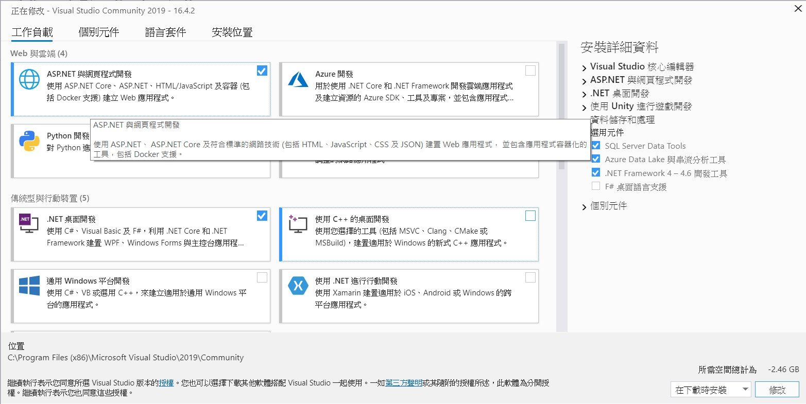
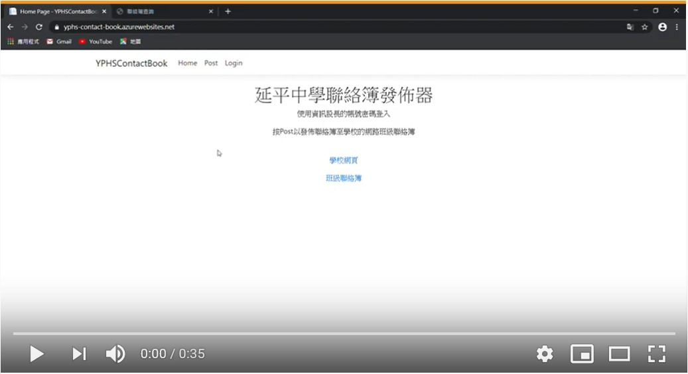

# 延平中學聯絡簿發佈器

延平中學聯絡簿發佈器是一個可以協助資訊股長發佈網路連絡簿的工具，不會因登入過久而連線逾時，並加入了薄持登入的功能。

## 安裝

1. 安裝[Visual Studio 2019](https://visualstudio.microsoft.com/thank-you-downloading-visual-studio/?sku=Community&rel=16)
2. 勾選**ASP.NET 與網頁程式開發**及 **.NET 桌面開發** 
3. 將此方案放入專案資料夾(預設: "C:\\Users\\\[使用者名稱\]\\source\\repos")
4. 開啟YPHSContactBook.sln
5. 修改/Controller/HomeController.cs 第16, 17行

## 使用範例

範例影片:  

範例網頁: [https://yphs-contact-book.azurewebsites.net/](https://yphs-contact-book.azurewebsites.net/)
